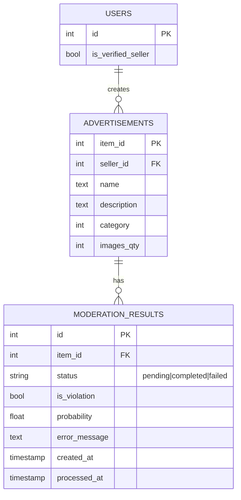

# Сервис модерации объявлений

## Запуск

### Через Docker Compose
```bash
docker compose up -d --build
```

Сервисы:
- API: `http://localhost:8003`
- Redpanda Console: `http://localhost:8080`
- PostgreSQL: `localhost:15432`
- Kafka bootstrap: `localhost:9092`
- Redis: `localhost:6379`

Остановить:
```bash
docker compose down
```

Сбросить данные БД:
```bash
docker compose down -v
```

---

## Тесты

```bash
python -m pytest -v
```

Только интеграционные:
```bash
python -m pytest -m integration
```

Только юнит:
```bash
python -m pytest -m "not integration"
```


## Описание проекта

Основные возможности:
- создание пользователей и объявлений;
- синхронный скоринг объявления (`/predict`, `/simple_predict`);
- асинхронная модерация через очередь Kafka/Redpanda (`/async_predict`);
- хранение статусов задач модерации в PostgreSQL (`moderation_results`);
- DLQ (`moderation_dlq`) для ошибочных сообщений с расширенным payload.

### ER-диаграмма


## API

### Справочник эндпоинтов

| Метод | Путь | Назначение |
|---|---|---|
| `GET` | `/` | health/check, возвращает `{"message":"Hello World"}` |
| `POST` | `/users` | создать пользователя |
| `POST` | `/advertisements` | создать объявление |
| `POST` | `/close` | закрыть объявление по `item_id` (удаляет объявление, результаты модерации и кэш) |
| `POST` | `/predict` | синхронный скоринг по полному payload объявления |
| `GET` | `/simple_predict?item_id=...` | синхронный скоринг по `item_id` |
| `POST` | `/async_predict` | создать асинхронную задачу модерации |
| `GET` | `/moderation_result/{task_id}` | получить статус асинхронной задачи |

## Структура проекта

```text
app/
  clients/        # подключения к PostgreSQL и Kafka
  db/migrations/  # SQL-миграции
  models/         # pydantic-модели
  repositories/   # слой доступа к данным
  routers/        # HTTP-эндпоинты FastAPI
  services/       # бизнес-логика и модель
  workers/        # Kafka worker модерации
docker-compose.yml
Dockerfile
```


Проверка кеша редиса
```bash
docker compose exec -T redis redis-cli DBSIZE
docker compose exec -T redis redis-cli --scan
```

