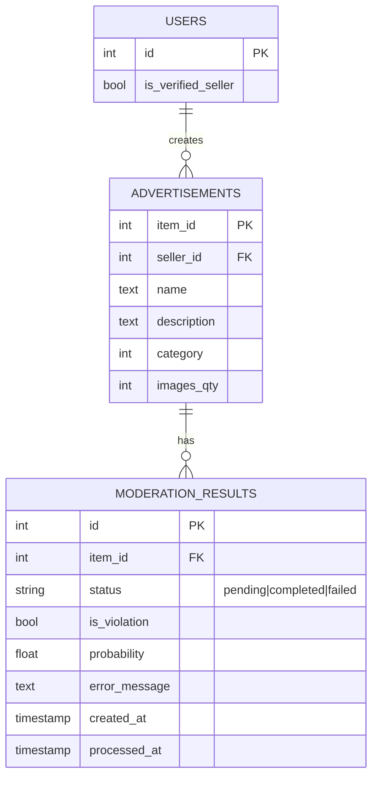

# Сервис модерации объявлений

## Запуск

### Через Docker Compose
```bash
docker compose up -d --build
```

Сервисы:
- API: `http://localhost:8003`
- Redpanda Console: `http://localhost:8080`
- PostgreSQL: `localhost:15432`
- Kafka bootstrap: `localhost:9092`
- Redis: `localhost:6379`
- Prometheus: `http://localhost:9090/`
- Grafana: `http://localhost:3000/`

### Sentry
Sentry в этом проекте нужен для сбора ошибок из API и Kafka worker в одном месте. Он помогает быстро понять, на каком эндпоинте или шаге воркера произошел сбой, с какими `item_id` или `task_id`, и увидеть stack trace вместе с контекстом запроса.

Интеграция отключена по умолчанию. Для включения передайте DSN через переменные окружения, которые уже проброшены в `api` и `worker`:

```bash
export SENTRY_DSN="https://<key>@sentry.io/<project>"
export SENTRY_ENV="local"
export SENTRY_RELEASE="back-dev"
docker compose up -d --build
```

В Sentry будут отправляться ошибки бизнес-логики и инфраструктуры, которые роутеры переводят в ответы API, а также terminal-failure сценарии воркера после исчерпания retry. Обычные пользовательские ошибки вроде `401`, `403` и `409` туда не отправляются, чтобы не засорять поток событий.

Минимальная проверка:
```bash
# 1. создать аккаунт и залогиниться
curl -X POST http://localhost:8003/accounts -H 'content-type: application/json' -d '{"login":"tester","password":"secret"}'
curl -i -X POST http://localhost:8003/login -H 'content-type: application/json' -d '{"login":"tester","password":"secret"}'

# 2. вызвать бизнес-ошибку, которая попадет в Sentry
curl -X GET 'http://localhost:8003/simple_predict?item_id=999999' --cookie 'x-user-token=<jwt>'
```

После этого в Sentry появится событие с `AdvertisementNotFoundError` и контекстом эндпоинта `simple_predict`.

Остановить:
```bash
docker compose down
```

Сбросить данные БД:
```bash
docker compose down -v
```

---

## Тесты

```bash
python -m pytest -v
```

Только интеграционные:
```bash
python -m pytest -m integration
```

Только юнит:
```bash
python -m pytest -m "not integration"
```


## Описание проекта

Основные возможности:
- создание пользователей и объявлений;
- синхронный скоринг объявления (`/predict`, `/simple_predict`);
- асинхронная модерация через очередь Kafka/Redpanda (`/async_predict`);
- хранение статусов задач модерации в PostgreSQL (`moderation_results`);
- DLQ (`moderation_dlq`) для ошибочных сообщений с расширенным payload.

### ER-диаграмма

```mermaid
erDiagram
    USERS ||--o{ ADVERTISEMENTS : creates
    ADVERTISEMENTS ||--o{ MODERATION_RESULTS : has

    USERS {
        int id PK
        bool is_verified_seller
    }

    ADVERTISEMENTS {
        int item_id PK
        int seller_id FK
        text name
        text description
        int category
        int images_qty
    }

    MODERATION_RESULTS {
        int id PK
        int item_id FK
        string status "pending|completed|failed"
        bool is_violation
        float probability
        text error_message
        timestamp created_at
        timestamp processed_at
    }
```

## API

### Справочник эндпоинтов

| Метод | Путь | Назначение |
|---|---|---|
| `GET` | `/` | health/check, возвращает `{"message":"Hello World"}` |
| `POST` | `/accounts` | создать аккаунт для последующего логина |
| `POST` | `/login` | получить auth-cookie по `login` и `password` |
| `POST` | `/users` | создать пользователя |
| `POST` | `/advertisements` | создать объявление |
| `POST` | `/close` | закрыть объявление по `item_id` (удаляет объявление, результаты модерации и кэш) |
| `POST` | `/predict` | синхронный скоринг по полному payload объявления |
| `GET` | `/simple_predict?item_id=...` | синхронный скоринг по `item_id` |
| `POST` | `/async_predict` | создать асинхронную задачу модерации |
| `GET` | `/moderation_result/{task_id}` | получить статус асинхронной задачи |

## Структура проекта

```text
app/
  clients/        # подключения к PostgreSQL и Kafka
  db/migrations/  # SQL-миграции
  models/         # pydantic-модели
  repositories/   # слой доступа к данным
  routers/        # HTTP-эндпоинты FastAPI
  services/       # бизнес-логика и модель
  workers/        # Kafka worker модерации
docker-compose.yml
Dockerfile
```


Проверка кеша редиса
```bash
docker compose exec -T redis redis-cli DBSIZE
docker compose exec -T redis redis-cli --scan
```
